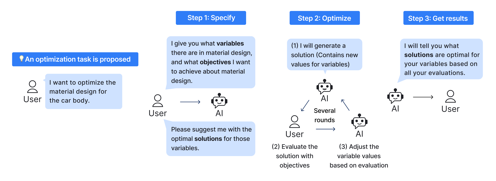

# Optimise Anything!

## Introduction
"Optimise Anything!" is a web service that enables non-expert people to interactively utilize Bayesian optimization in the back end to solve optimization problems. 

## Access the service: http://optimizeanything.dice.aalto.fi/

## Paper and Authors list：
Paper: link 
Fengyu Li, [Antti Oulasvirta](https://users.aalto.fi/~oulasvir/), Aalto University, Finland 
[John Dudley](https://www.jjdudley.com/),  [Per Ola Kristensson](https://pokristensson.com/),  University of Cambridge, UK 
[LiWei Chan](https://people.cs.nycu.edu.tw/~liweichan/), National Yang Ming Chiao Tung University, Taiwan 

The project builds on the previous work on MOBO by [L. Chan et. al](https://dl.acm.org/doi/pdf/10.1145/3491102.3501850)1, [Y. -C. Liao et al.](https://ieeexplore.ieee.org/stamp/stamp.jsp?tp=&arnumber=10024515)2, and [G. Mo](https://github.com/georgemo535/D3MOBO)3.

## How to install
Apache is used to run the program locally and so ensure you have [XAMPP](https://www.apachefriends.org/) installed first before use. To run the program: 
1. Download the files as a zip folder.
2. Copy the folder into `htdocs` within the `xampp` folder in your Local Disk.
3. Ensure the first line of the Python files in the `cgi` folder contains the file path to Python on your local system.
4. Click "Start" on the Apache module in the XAMPP Control Panel.
5. Copy the file path to the `welcome.php` page into a web browser using the following format: `http://localhost/Demo/welcome.php` where `Demo` is the filepath to `welcome.php` from the folder `htdocs`.
6. Follow the instructions and proceed with the application.

## Front-end
The PHP files represent the front-end of the program. The sequence of pages is:
1. `welcome.php`: Welcome page
2. `how-it-works.php`: Brief overview of how the AI-user guided optimisation works
3. `define.php`: Page to define design parameters and design objectives
4. `confirm-definitions.php`: Confirmation of design definitions
5. `existing-solutions.php`: Known bad solutions can be added here
6. `optimise.php`: Solutions proposed by AI and evaluated by the user
7. `results.php`: Summary of best solutions evaluated

`styles.css` is the stylesheet used as the foundation for the pages. `help.php` offers an explanation of the key stages to the program (defining design parameters and objectives, adding existing solutions, optimisation, and results), and can be accessed via those respective pages.

## Back-end
The `cgi` folder contains the Python scripts that form the back-end to the program. The purpose of each is listed below:
1. `log-definitions.py`: Saves and stores the design parameters and objectives to the SQL database `Data\database.db` after confirming the entries in `confirm-definitons.php`.
2. `import-all.py`: Contains all the relevant BoTorch modules and necessary parameters to be imported to perform the optimisation.
3. `initial-mobo.py`: The Python script where MOBO takes place. There are several functions that are implemented and executed depending on the user's choice: skip, give next solution or refine solution. 
4. `finish-solutions.py`: The script is used to determine the best solutions from those evaluated by optimising for each objective respectively. It also gives the best solution that balances both objectives.

The `cgi` Python module is used to store the necessary variables and information to transfer between the server and client sides of the program. 

## Miscellaneous
The `Archive` folder includes previous copies of files for testing and reference purposes. The `Pictures` folder includes the images used in the front-end in the program. 

## References
1. Chan, L. et al. (2022) ‘Investigating positive and negative qualities of human-in-the-loop optimization for designing interaction techniques’, CHI Conference on Human Factors in Computing Systems [Preprint]. doi:10.1145/3491102.3501850.
2. Y. -C. Liao et al., "Interaction Design With Multi-Objective Bayesian Optimization," in IEEE Pervasive Computing, vol. 22, no. 1, pp. 29-38, 1 Jan.-March 2023, doi: 10.1109/MPRV.2022.3230597.
3. Mo, G. D3MOBO, GitHub. Available at: https://github.com/georgemo535/D3MOBO. 

# OptimiseAnything

nano /etc/apache2/sites-available/000-default.conf - 
<Directory /var/www/OptimiseAnything/>
    Options +ExecCGI
    PassEnv LANG
    AddHandler cgi-script .py

nano /etc/apache2/conf-available/serve-cgi-bin.conf -
<IfModule mod_alias.c>
        <IfModule mod_cgi.c>
                Define ENABLE_USR_LIB_CGI_BIN
        </IfModule>

        <IfModule mod_cgid.c>
                Define ENABLE_USR_LIB_CGI_BIN
        </IfModule>

        <IfDefine ENABLE_USR_LIB_CGI_BIN>
                ScriptAlias /cgi-bin/ /var/www/OptimiseAnything/
                <Directory "/var/www/OptimiseAnything/">
                         AllowOverride None
                         Options +ExecCGI
                         AddHandler cgi-script. py 

                </Directory>
        </IfDefine>
</IfModule>
</Directory>

文件权限

https://medium.com/@rohan_precise/step-by-step-guide-setting-up-and-connecting-mysql-on-ec2-ubuntu-instance-72c627e6c27f
https://askubuntu.com/questions/668734/the-requested-url-phpmyadmin-was-not-found-on-this-server
